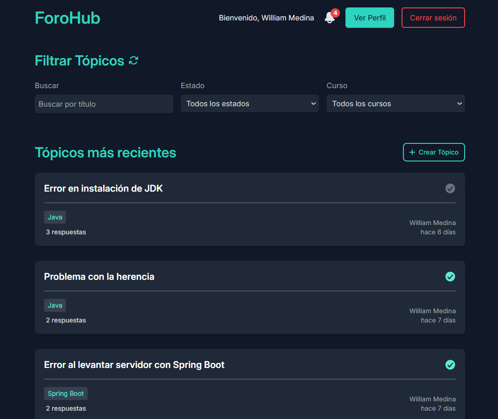
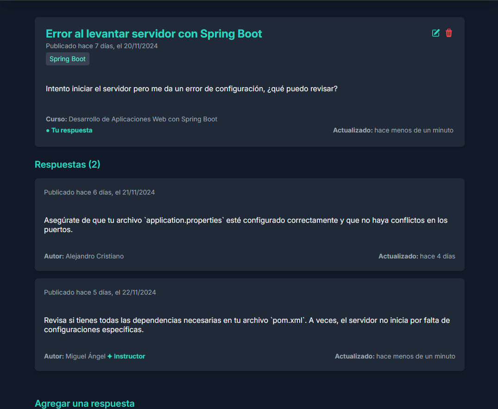
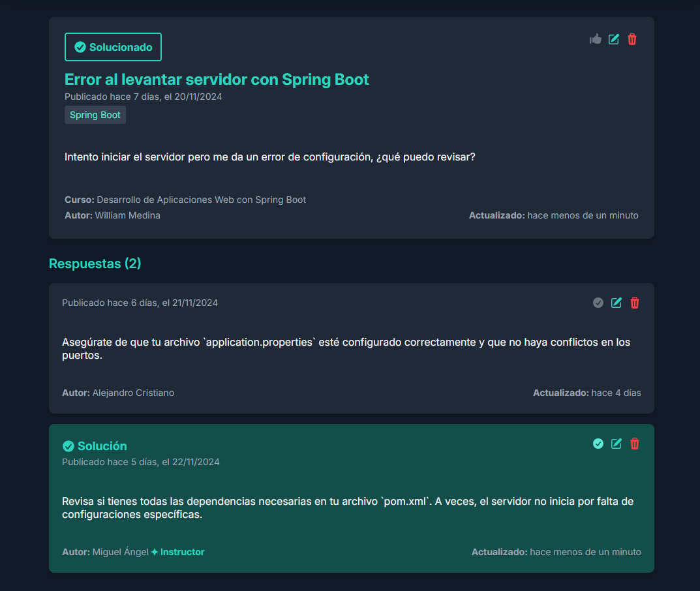
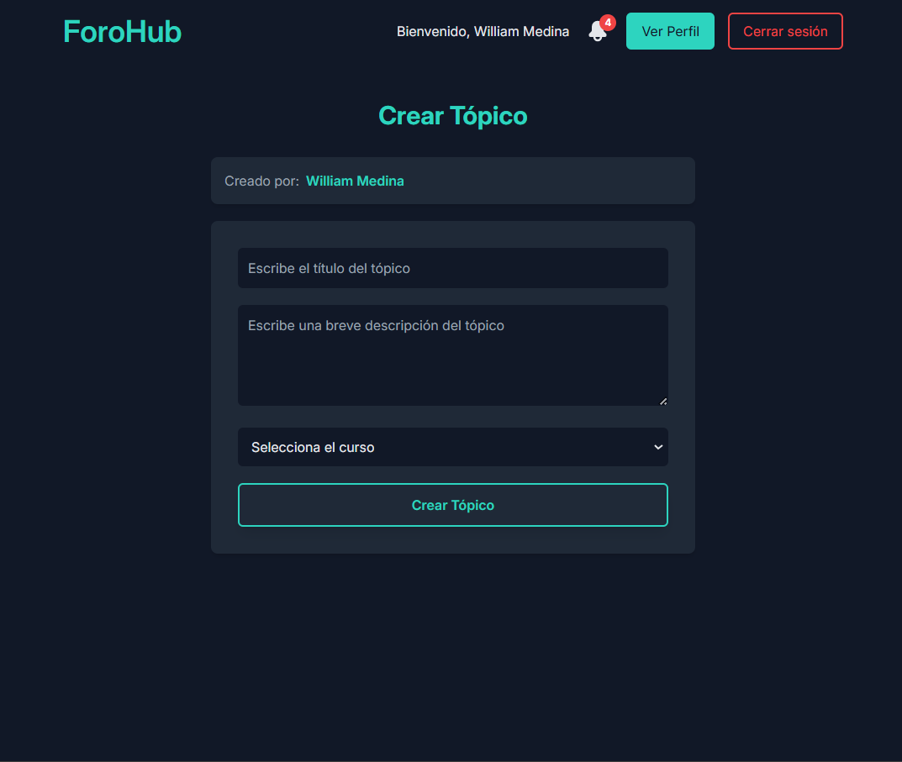
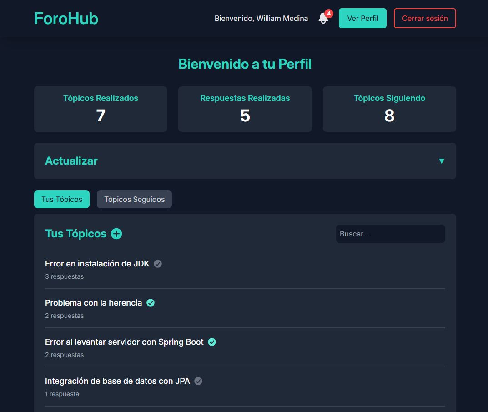
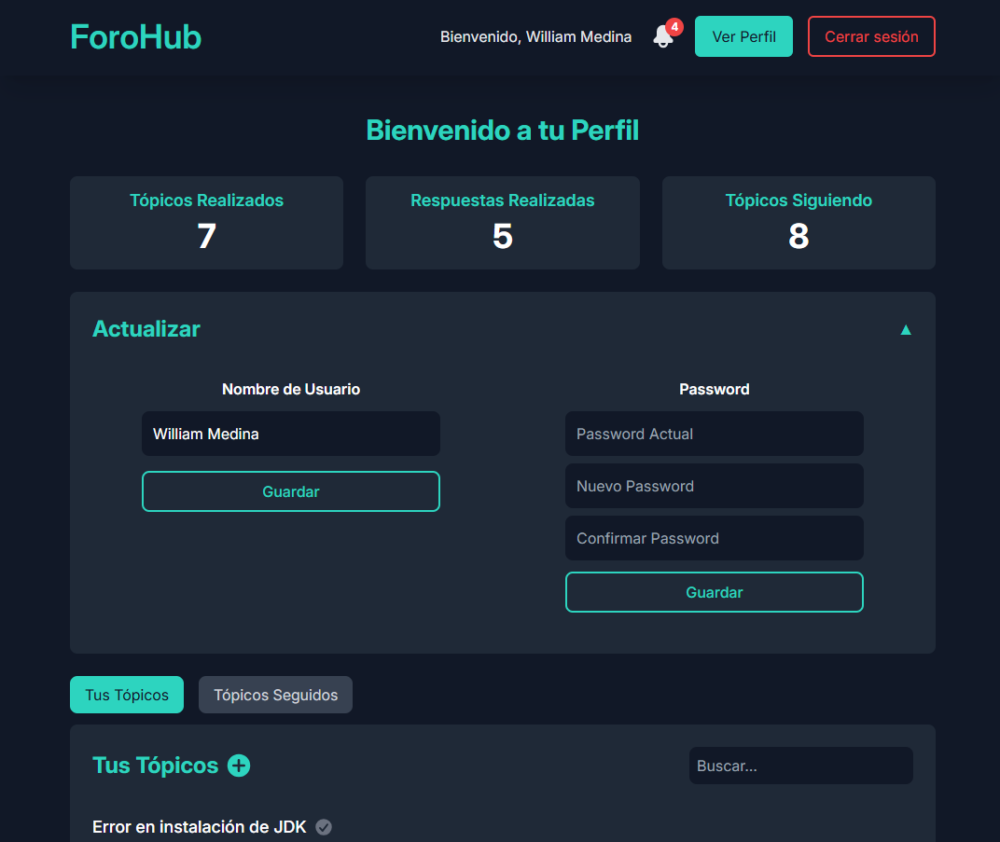
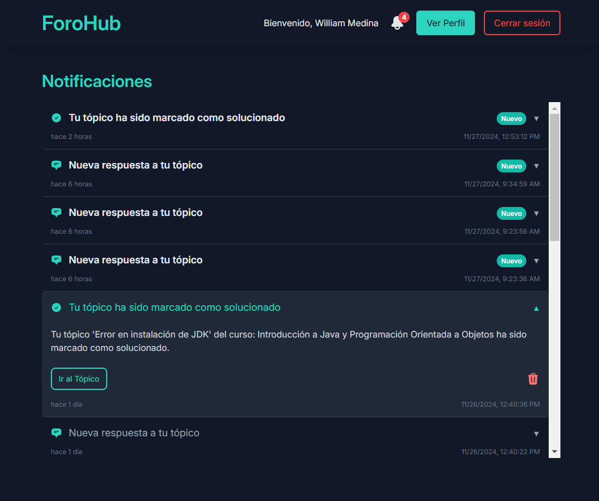

# 🌐 ForoHub App


## 📋 Índice
1. [📝 Descripción](#-descripción)
2. [✨ Características](#-características)
3. [💻 Tecnologías Utilizadas](#-tecnologías-utilizadas)
4. [🌐 Integración con la API](#-integración-con-la-api)
5. [🔧 Instrucciones](#-instrucciones)
6. [📸 Capturas de Pantalla](#-capturas-de-pantalla)
7. [🚀 Ver el Proyecto en Producción](#-ver-el-proyecto-en-producción)
8. [⚙️ Integración con Arquitectura de Microservicios](#️-integración-con-arquitectura-de-microservicios)
9. [📜 Licencia](#-licencia)
10. [👨‍💻 Autor](#-autor)

## 📝 Descripción

**ForoHub** es una aplicación desarrollada con **React** y **TypeScript**, diseñada para interactuar con una API construida en **Spring Boot**. Esta plataforma permite a los usuarios explorar, crear y participar en tópicos organizados por cursos, incluyendo la gestión de respuestas.

Los usuarios pueden registrarse, gestionar sus perfiles e interactuar con los tópicos. Además, la aplicación incluye características para administradores, moderadores e instructores, quienes tienen permisos especiales para gestionar contenido.

ForoHub combina un diseño moderno y responsivo, creado con Tailwind CSS, para proporcionar una experiencia de usuario atractiva y eficiente, funcionando como la interfaz perfecta para el backend.

## ✨ Características  

- **🏠 Página principal (Home)**:  
  - Visualización de tópicos recientes con un sistema de paginación eficiente para facilitar la navegación.  
  - Herramientas de filtrado por estado, palabra clave o curso, garantizando búsquedas rápidas y precisas.  
  - Indicadores visuales intuitivos que destacan si un tópico ha sido solucionado y el número de respuestas asociadas.  

- **🔔 Notificaciones en tiempo real**:  
  - Ícono de notificaciones en el encabezado que muestra un contador dinámico de mensajes no leídos.  
  - Actualización periódica automatizada para detectar nuevas notificaciones en tiempo real.  
  - Acceso directo a la página de notificaciones desde el ícono, donde se pueden ver las notificaciones completas y redirigir a los tópicos correspondientes. Las notificaciones pueden eliminarse o marcarse como vistas para una gestión más organizada. 

- **💬 Gestión de tópicos y respuestas**:  
  - Funcionalidad completa para que los usuarios puedan crear, editar y eliminar sus propios tópicos.  
  - Interactividad que permite responder a tópicos propios y de otros usuarios, así como editar y eliminar tanto las respuestas propias como los tópicos creados por el usuario.
  - Posibilidad de seguir tópicos para recibir notificaciones sobre nuevas respuestas o cambios de estado.  

- **🔑 Funciones avanzadas para roles con privilegios**:  
  - Instructores, moderadores y administradores disponen de permisos exclusivos para modificar o eliminar cualquier tópico o respuesta dentro de la plataforma.  
  - Capacidad de marcar una respuesta como solución, lo que cierra automáticamente el tópico para nuevas interacciones y lo marca como resuelto.  

- **👤 Página de perfil del usuario**:  
  - Visualización de estadísticas personales, incluyendo el número de tópicos creados, respuestas realizadas y tópicos seguidos.  
  - Herramientas para actualizar información personal como el nombre de usuario y el password.  
  - Listado interactivo que permite alternar entre tópicos creados y seguidos, con opciones de filtrado por palabra clave.  


- **🔒 Autenticación**:  
  - Proceso seguro de registro y acceso a la plataforma mediante login.  
  - Envío automatizado de email para la confirmación de cuenta, con opción de reenvío en caso de ser necesario.  
  - Funcionalidad para solicitar y gestionar tokens de recuperación de password en caso de olvido.  


## 💻 Tecnologías Utilizadas

- **React**: Una biblioteca de JavaScript para construir interfaces de usuario.
- **TypeScript**: Un superconjunto tipado de JavaScript que se compila a JavaScript puro.
- **Tailwind CSS**: Un framework CSS basado en utilidades para el desarrollo rápido de interfaces.
- **Vite**: Una herramienta de construcción rápida y un servidor de desarrollo.
- **Axios**: Un cliente HTTP basado en promesas para hacer solicitudes al backend.
- **React Router DOM**: Un sistema de enrutamiento para manejar la navegación dentro de la aplicación de una sola página (SPA).
- **React Query**: Una biblioteca para el manejo de datos asincrónicos, caché y sincronización con el servidor.
- **Zustand**: Un estado global ligero y fácil de usar para React.
- **React Toastify**: Una librería para mostrar notificaciones de tipo "toast" en la interfaz de usuario.
- **Date-fns**: Una biblioteca para manipulación de fechas, que ofrece funciones sencillas y modulares.
- **Heroicons**: Un conjunto de íconos diseñados para ser usados con Tailwind CSS.


## 🌐 Integración con la API

La App de **ForoHub** depende de una API externa para obtener datos y manejar las interacciones del usuario. La API es esencial para el correcto funcionamiento de la aplicación.

### Repositorio de la API

La API para **ForoHub** se encuentra en un repositorio separado. Puedes encontrarla aquí:

- [ForoHub API](https://github.com/william-medina/forohub-api) - Este repositorio contiene la API en Spring Boot.


### Configuración de la API

La aplicación frontend se comunica con la API del backend a través de una variable de entorno. Asegúrate de que la URL base de la API esté configurada correctamente para incluir la ruta `/api`.

- **Variable de Entorno del Frontend**: `VITE_API_URL`

  - El valor de `VITE_API_URL` debe configurarse con la URL base de la API con el endpoint `/api`, por ejemplo: `http://localhost:8080/api`.

Asegúrate de que esta variable apunte al endpoint correcto de la API.

## 🔧 Instrucciones

Para comenzar con App de **ForoHub**, sigue estos pasos:

### Requisitos Previos

- [Node.js](https://nodejs.org/) (Se recomienda usar la última versión LTS para mayor estabilidad)
- [NPM](https://www.npmjs.com/) (Node Package Manager)

### Instalación

1. Clona el repositorio:

    ```bash
    git clone https://github.com/william-medina/forohub-app.git
    ```

2. Navega al directorio del proyecto:

    ```bash
    cd forohub-app
    ```

3. Instala las dependencias:

    ```bash
    npm install
    ```

4. Configura las variables de entorno:

    Crea un archivo `.env.local` en la raíz de tu directorio del proyecto y añade la siguiente línea:

    ```env
    VITE_API_URL=http://localhost:8080/api
    ```

    Este archivo se usa para configurar ajustes específicos del entorno, como la URL de la API.

### Desarrollo

Para iniciar el servidor de desarrollo, usa el siguiente comando:

```bash
npm run dev
```

### Construcción

Para construir la aplicación para producción, sigue estos pasos:

1. **Ejecuta el Comando de Construcción**

    Ejecuta el siguiente comando para compilar el código TypeScript y empaquetar la aplicación para producción:

    ```bash
    npm run build
    ```

    Este comando hará lo siguiente:

    - Compilará los archivos TypeScript en JavaScript.
    - Empaquetará todos los activos y dependencias usando Vite.
    - Generará los archivos listos para producción en el directorio `dist`.

2. **Despliega la Construcción**

    Una vez que el proceso de construcción esté completo, puedes desplegar el contenido del directorio `dist` en tu servidor de producción. El directorio `dist` contendrá todos los archivos necesarios para servir la aplicación.

3. **Verifica la Construcción**

    Para asegurarte de que todo funcione correctamente, puedes usar el comando de vista previa para probar localmente la construcción de producción antes de desplegar:

    ```bash
    npm run preview
    ```

    Esto servirá la construcción de producción y te permitirá verificar que la aplicación se comporte como se espera.

Siguiendo estos pasos, generarás una versión lista para producción del App de **ForoHub**.


## 📸 Capturas de Pantalla

Aquí hay algunas capturas de pantalla de la App de **ForoHub**:

### Página de inicio


### Tópico activo


### Tópico cerrado (resuelto)


### Tópico con permisos de administrador


### Crear tópico


### Perfil


### Actualizar perfil


### Notificaciones


## 🚀 Ver el Proyecto en Producción

El frontend de **ForoHub App** se encuentra desplegado y conectado a la API, listo para ser explorado. Puedes acceder a la aplicación en el siguiente enlace:

👉 [Ver Proyecto en Producción](https://forohub.william-medina.com)


> **⚠️ Importante**: Ten en cuenta que la API podría tardar unos instantes en responder si no ha sido utilizada recientemente, ya que el servidor necesita tiempo para iniciarse. Esto es normal debido a las limitaciones del entorno de ejecución. Si experimentas algún retraso, espera unos minutos hasta que el servidor esté operativo e inténtalo nuevamente.

## ⚙️ Integración con Arquitectura de Microservicios

La App de **ForoHub** puede conectarse tanto a una **API monolítica** como a un **backend con arquitectura de microservicios**. Para la integración con microservicios y autenticación mediante OAuth2, se deben configurar algunas variables de entorno clave en el frontend.

### Variables de Entorno Clave

Crea o modifica el archivo `.env.local` en la raíz del proyecto con las siguientes variables:

```env
# Indica si la app se conecta a microservicios
VITE_IS_MICROSERVICES=true

# Configuración de OAuth2
VITE_OAUTH2_CLIENT_ID=forohub-frontend
VITE_AUTH_URL=http://localhost:9000
VITE_TOKEN_URL=http://localhost:9001/token

# URL base de la API para consumir datos de microservicios
VITE_API_URL=http://localhost:8080/api
```
### Cómo Funciona la Integración

1. **Autenticación OAuth2**:  
   - Cuando el usuario hace clic en **Login** desde el frontend de ForoHub, se **redirige automáticamente al Auth Server** (`VITE_AUTH_URL`).  
   - En el Auth Server, se presenta un **formulario de login** idéntico al del frontend, pero gestionado directamente por el backend.  
   - Tras autenticarse correctamente, el Auth Server devuelve un **authorization code** al frontend mediante redirección.

2. **Intermediario Token Gateway**:  
   - El **Token Gateway** (`VITE_TOKEN_URL`) actúa como intermediario entre el frontend y el Auth Server.  
   - Su función principal es **intercambiar el authorization code por access token y refresh token**.  
   - También puede **generar un nuevo access token usando el refresh token** y manejar revocación de sesiones.  

3. **Consumo de Microservicios vía API Gateway**:  
   - El frontend consume todos los microservicios de recursos a través del **API Gateway**, que unifica los endpoints.  
   - Todos los requests a los microservicios deben incluir el **access token** en el encabezado `Authorization`.  
   - El API Gateway valida el token antes de reenviar la solicitud al microservicio correspondiente.  


4. **Cambio entre Monolito y Microservicios**:  
   - La variable `VITE_IS_MICROSERVICES` permite alternar entre el **backend monolítico** y la **arquitectura de microservicios** sin cambiar código.  
   - Si está en `false`, el frontend apunta a `VITE_API_URL` que referencia la **API monolítica**.  
   - Si está en `true`, el frontend apunta a `VITE_API_URL`, que corresponde al **API Gateway**, el cual expone todos los microservicios de recursos. Para obtener los tokens necesarios de acceso, las solicitudes pasan primero por el **Token Gateway**, que se comunica con el **Auth Server** vía OAuth2.

### Repositorio del Backend con Microservicios

El backend con arquitectura de microservicios de **ForoHub** se encuentra en un repositorio separado. Puedes encontrarlo aquí:

- [ForoHub Microservices](https://github.com/william-medina/forohub-microservices) - Contiene la implementación en Spring Boot.


## 📜 Licencia

Este proyecto está bajo la Licencia MIT. Para más detalles, consulta el archivo [LICENSE](./LICENSE).


## 👨‍💻 Autor

La aplicación de **ForoHub** es desarrollada y mantenida por:

**William Medina**

¡Gracias por revisar **ForoHub App**! Puedes encontrarme en [GitHub](https://github.com/william-medina)