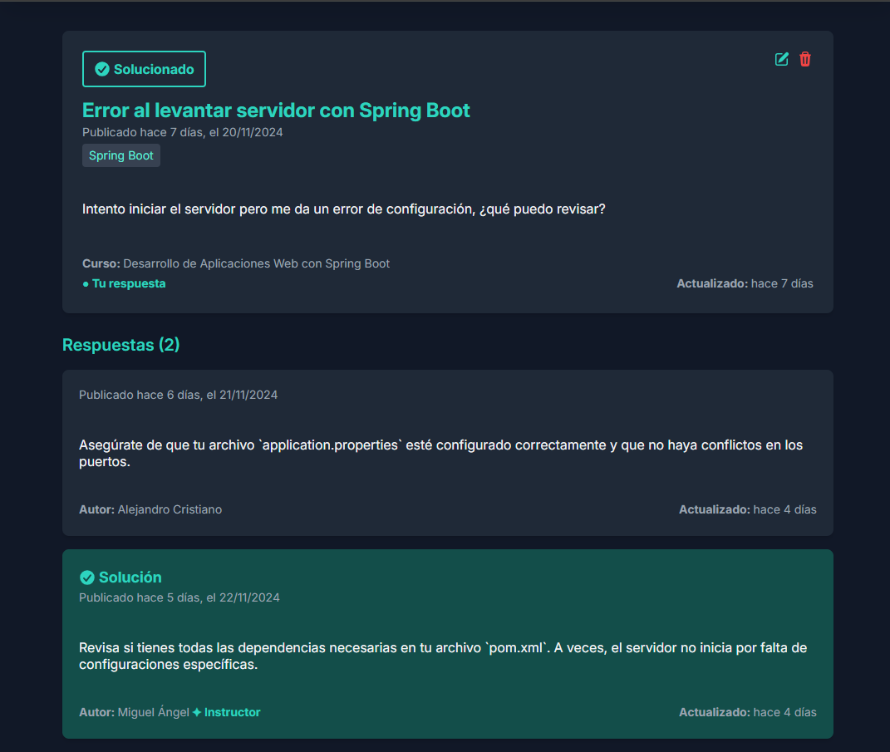

# ForoHub App


## Índice
1. [📝 Descripción](#-descripción)
2. [✨ Características](#✨-características)
3. [💻 Tecnologías Utilizadas](#💻-tecnologías-utilizadas)
4. [🌐 Integración con la API](#🌐-integración-con-la-api)
5. [⚙️ Instrucciones](#⚙️-instrucciones)
6. [📸 Capturas de Pantalla](#📸-capturas-de-pantalla)
7. [🚀 Ver el Proyecto en Producción](#🚀-ver-el-proyecto-en-producción)
8. [📜 Licencia](#📜-licencia)
9. [👨‍💻 Autor](#👨‍💻-autor)

## 📝 Descripción

**ForoHub** es una aplicación frontend desarrollada con **React** y **TypeScript**, diseñada para interactuar con una API construida en **Spring Boot**. Esta plataforma permite a los usuarios explorar, crear y participar en discusiones organizadas por cursos, incluyendo la gestión de tópicos y respuestas.

Los usuarios pueden registrarse, gestionar sus perfiles e interactuar con las discusiones. Además, la aplicación incluye características para administradores, moderadores e instructores, quienes tienen permisos especiales para gestionar contenido y marcar soluciones en los tópicos.

ForoHub combina un diseño moderno y responsivo, creado con Tailwind CSS, para proporcionar una experiencia de usuario atractiva y eficiente, funcionando como la interfaz perfecta para la API del backend.

## ✨ Características  

- **🏠 Página principal (Home)**:  
  - Visualización de tópicos recientes con un sistema de paginación eficiente para facilitar la navegación.  
  - Herramientas avanzadas de filtrado por estado, palabra clave o curso, garantizando búsquedas rápidas y precisas.  
  - Indicadores visuales intuitivos que destacan si un tópico ha sido solucionado y el número de respuestas asociadas.  

- **🔔 Notificaciones en tiempo real**:  
  - Ícono de notificaciones en el encabezado que muestra un contador dinámico de mensajes no leídos.  
  - Actualización periódica automatizada para detectar nuevas notificaciones en tiempo real.  
  - Acceso directo a la página de notificaciones desde el ícono, donde se pueden ver las notificaciones completas y redirigir a los tópicos correspondientes. Las notificaciones pueden eliminarse o marcarse como vistas para una gestión más organizada. 

- **💬 Gestión de tópicos y respuestas**:  
  - Funcionalidad completa para que los usuarios puedan crear, editar y eliminar sus propios tópicos.  
  - Interactividad que permite responder tanto a tópicos propios como de otros usuarios, con opciones de edición y eliminación de las respuestas propias.  
  - Posibilidad de seguir tópicos específicos para recibir notificaciones sobre nuevas respuestas o cambios de estado.  

- **🔑 Funciones avanzadas para roles con privilegios**:  
  - Instructores, moderadores y administradores disponen de permisos exclusivos para modificar o eliminar cualquier tópico o respuesta dentro de la plataforma.  
  - Capacidad de marcar una respuesta como solución, lo que cierra automáticamente el tópico para nuevas interacciones y lo marca como resuelto.  

- **👤 Página de perfil del usuario**:  
  - Visualización de estadísticas personales, incluyendo el número de tópicos creados, respuestas realizadas y tópicos seguidos.  
  - Herramientas para actualizar información personal como el nombre de usuario y el password.  
  - Listado interactivo que permite alternar entre tópicos creados y seguidos, con opciones de filtrado por palabra clave.  


- **🔒 Autenticación**:  
  - Proceso seguro de registro y acceso a la plataforma mediante login.  
  - Envío automatizado de email para la confirmación de cuenta, con opción de reenvío en caso de ser necesario.  
  - Funcionalidad para solicitar y gestionar tokens de recuperación de password en caso de olvido.  


## 💻 Tecnologías Utilizadas

- **React**: Una biblioteca de JavaScript para construir interfaces de usuario.
- **TypeScript**: Un superconjunto tipado de JavaScript que se compila a JavaScript puro.
- **Tailwind CSS**: Un framework CSS basado en utilidades para el desarrollo rápido de interfaces.
- **Vite**: Una herramienta de construcción rápida y un servidor de desarrollo.
- **Axios**: Un cliente HTTP basado en promesas para hacer solicitudes al backend.
- **React Router DOM**: Un sistema de enrutamiento para manejar la navegación dentro de la aplicación de una sola página (SPA).
- **React Query**: Una biblioteca para el manejo de datos asincrónicos, caché y sincronización con el servidor.
- **Zustand**: Un estado global ligero y fácil de usar para React.
- **React Toastify**: Una librería para mostrar notificaciones de tipo "toast" en la interfaz de usuario.
- **Date-fns**: Una biblioteca para manipulación de fechas, que ofrece funciones sencillas y modulares.
- **Heroicons**: Un conjunto de íconos diseñados para ser usados con Tailwind CSS.


## 🌐 Integración con la API

La App de **ForoHub** depende de una API externa para obtener datos y manejar las interacciones del usuario. La API es esencial para el correcto funcionamiento de la aplicación.

### Repositorio de la API

La API para **ForoHub** se encuentra en un repositorio separado. Puedes encontrarla aquí:

- [ForoHub API](https://github.com/william-medina/forohub-api) - Este repositorio contiene la API en Spring Boot.


### Configuración de la API

La aplicación frontend se comunica con la API del backend a través de una variable de entorno. Asegúrate de que la URL base de la API esté configurada correctamente para incluir la ruta `/api`.

- **Variable de Entorno del Frontend**: `VITE_API_URL`

  - El valor de `VITE_API_URL` debe configurarse con la URL base de la API con el endpoint `/api`, por ejemplo: `http://localhost:8080/api`.

Asegúrate de que esta variable apunte al endpoint correcto de la API.

## ⚙️ Instrucciones

Para comenzar con App de **ForoHub**, sigue estos pasos:

### Requisitos Previos

- [Node.js](https://nodejs.org/) (Se recomienda usar la última versión LTS para mayor estabilidad)
- [NPM](https://www.npmjs.com/) (Node Package Manager)

### Instalación

1. Clona el repositorio:

    ```bash
    git clone https://github.com/william-medina/forohub-app.git
    ```

2. Navega al directorio del proyecto:

    ```bash
    cd forohub-app
    ```

3. Instala las dependencias:

    ```bash
    npm install
    ```

4. Configura las variables de entorno:

    Crea un archivo `.env.local` en la raíz de tu directorio del proyecto y añade la siguiente línea:

    ```env
    VITE_API_URL=http://localhost:8080/api
    ```

    Este archivo se usa para configurar ajustes específicos del entorno, como la URL de la API.

### Desarrollo

Para iniciar el servidor de desarrollo, usa el siguiente comando:

```bash
npm run dev
```

### Construcción

Para construir la aplicación para producción, sigue estos pasos:

1. **Ejecuta el Comando de Construcción**

    Ejecuta el siguiente comando para compilar el código TypeScript y empaquetar la aplicación para producción:

    ```bash
    npm run build
    ```

    Este comando hará lo siguiente:

    - Compilará los archivos TypeScript en JavaScript.
    - Empaquetará todos los activos y dependencias usando Vite.
    - Generará los archivos listos para producción en el directorio `dist`.

2. **Despliega la Construcción**

    Una vez que el proceso de construcción esté completo, puedes desplegar el contenido del directorio `dist` en tu servidor de producción. El directorio `dist` contendrá todos los archivos necesarios para servir la aplicación.

3. **Verifica la Construcción**

    Para asegurarte de que todo funcione correctamente, puedes usar el comando de vista previa para probar localmente la construcción de producción antes de desplegar:

    ```bash
    npm run preview
    ```

    Esto servirá la construcción de producción y te permitirá verificar que la aplicación se comporte como se espera.

Siguiendo estos pasos, generarás una versión lista para producción del App de **ForoHub**.


## 📸 Capturas de Pantalla

Aquí hay algunas capturas de pantalla de la App de **ForoHub**:

### Página de inicio


### Tópico activo


### Tópico cerrado (resuelto)


### Tópico con permisos de administrador


### Crear tópico


### Perfil


### Actualizar perfil


### Notificaciones


## 🚀 Ver el Proyecto en Producción

El frontend de **ForoHub App** se encuentra desplegado y conectado a la API, listo para ser explorado. Puedes acceder a la aplicación en el siguiente enlace:

👉 [Ver Proyecto en Producción](https://forohub.william-medina.com)


> **⚠️ Importante**: Ten en cuenta que la API puede tardar unos momentos en estar completamente funcional si no ha sido utilizada recientemente. Esto es normal debido a las limitaciones de su entorno de ejecución. Si experimentas algún retraso, simplemente espera unos minutos e inténtalo de nuevo.


## 📜 Licencia

Este proyecto está bajo la Licencia MIT. Para más detalles, consulta el archivo [LICENSE](./LICENSE).


## 👨‍💻 Autor

La aplicación de **ForoHub** es desarrollada y mantenida por:

**William Medina**

¡Gracias por revisar **ForoHub App**! Puedes encontrarme en [GitHub](https://github.com/william-medina)